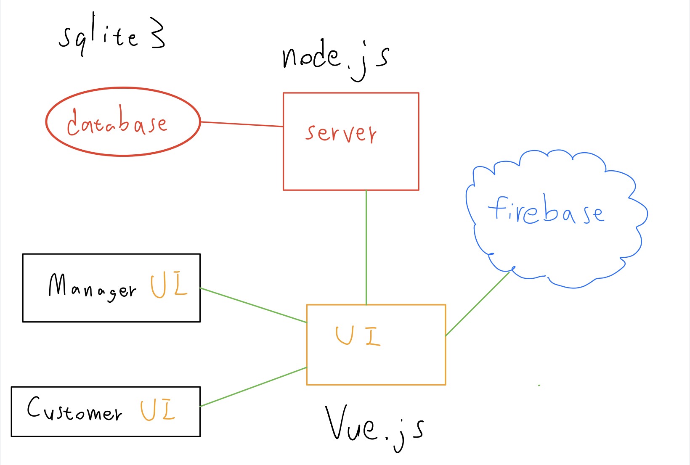

# Online_Shopping_System
## 題目說明
- 線上購物系統
- 買家可以註冊帳號並在網站上選購商品
- 賣家可從生產商進貨，並上架賣給消費者，並有後台管理系統可以管理自己的商城

## 系統功能需求分析
- 買家
  1. 可以在賣場搜尋商品種類，商家名稱，並把商品加入購物車
  2.	可從購物車刪除已選擇的商品
  3.	在購物車裡可以選擇商品數量並購買
  4.	購買後的商品可在歷史紀錄裡查看
  
- 賣家
  1.	可訂商品到指定倉庫
  2.	可從倉庫選擇商品上架販賣
  3.	可確認倉庫和架上貨品狀態
  4.	可查看出售紀錄
  5.	可以查看時間內營業額
  
## 資料需求分析 

- 買家
  * UserExist (Read):
    * 確認註冊的帳號是否已經存在
  
  * Register (Create):
    * 輸入使用者資料及設定密碼並註冊帳號
  
  * Search_Product (Read): 
    * 前端傳入ShopID,產品種類和頁數，後端會傳出所有此種產品的所有資訊。
  
  * Get_All_Type (Read): 
    * 後端會傳回所有type放入選單。
  
  * Get_All_ShopName (Read): 
    * 後端會傳回所有ShopName放入選單。
  
  * Get_Product_MaxPage (Read): 
    * 前端輸入ShopID和產品種類，後端會傳回產品的最大頁數。
  
  * Add_Product_In_Cart (Create): 
    * 前端輸入ProductID,ProductSupplierID,CustomerID和ShopID，後端會將此產品加入到這位顧客的購物車裡，如果已經在購物車了則會回傳error。
    
  * Delete_Product_In_Cart (Delete):
    * 前端傳入使用者id、產品資訊，後端會從購物車裡刪除商品
  
  * Get_Products_IN_Cart (Read): 
    * 前端傳入CustomerID，後端則會傳出此顧客他的購物車裡有什麼內容。
  
  * Buy_All_In_Cart (Create, Update, Delete): 
    * 前端傳入CustomerID，後端會幫此顧客購買他所有在購物車裡的產品。
  
  * AddProductNum (Update): 
    * 前端傳入CustomerID,ProductSupplierID,ShopID和ProductID，後端會幫此顧客增加一個這個商品在他購物車的數量。
  
  * SubtractProductNum (Update): 
    * 前端傳入CustomerID,ProductSupplierID,ShopID和ProductID，後端會幫此顧客減少一個這個商品在他購物車的數量。
  
  * Customer_TradeHistory (Read): 
    * 前端傳入CustomerID跟頁數，後端會回傳此顧客的交易歷史。
  
  * GetTradeHistoryMaxPage (Read): 
    * 前端傳入CustomerID，後端傳回此顧客交易歷史最大頁數。

- 賣家
  * UserExist (Read):
    * 確認註冊的帳號是否已經存在
  
  * Register (Create):
    * 輸入使用者資料及密碼並註冊成為賣家
  
  * GetRevenue (Read): 
    * 前端傳入ManagerID，後端會回傳此管理者的營業額。
  
  * GetOrderHistory (Read): 
    * 前端傳入ManagerID。
  
  * GetTradeHistory (Read): 
    * 前端傳入ManagerID，後端會回傳此管理者的交易歷史。包括time, product name, quantity, price, historyID, total price, customerID。
  
  * GetStoreHouseID (Read): 
    * 後端會回傳所有倉庫的ID。
  
  * OrderProduct (Create, Update): 
    * 前端輸入StoreHouseID, ShopManagerID, ProductSupplierID, ProductID, Num，後端會幫此管理者下單他要的產品以及數量到倉庫裡。
  
  * GetForSale (Read): 
    * 前端輸入ManagerID，後端會回傳此管理者在架上的所有產品。包括ProductID,SupplierID,Productname, Productprice, Quantity。
  
  * GetHave (Read): 
    * 前端輸入ManagerID，後端會傳回此管理者擁有的所有產品以及數量。包括ProductID,SupplierID,Productname, Quantity, StoreHouseID。
  
  * ForSell (Create, Update): 
    * 前端輸入ManagerID,ProductID,SupplierID, Quantity,ProductPrice, StoreHouseID，後端會把此管理者這個產品在架上的數量增加，並且減少庫存數量，如果不在架上則會幫忙新增。
  
  * PriceChange (Update): 
    * 前端輸入ManagerID,ProductID,SupplierID,ProductPrice，後端會幫忙把此產品的價格改成輸入的價格。

## 系統功能

- 主頁 (Home)

- 買家登入 

- 選購商品

- 購物車

- 購買紀錄

   

- 賣家登入

- 倉儲管理

- 訂貨紀錄

- 交易紀錄

- 向生產商進貨

- 查看營業額

   
## ER Model

   
## Relational Schema

   

## 系統架構

