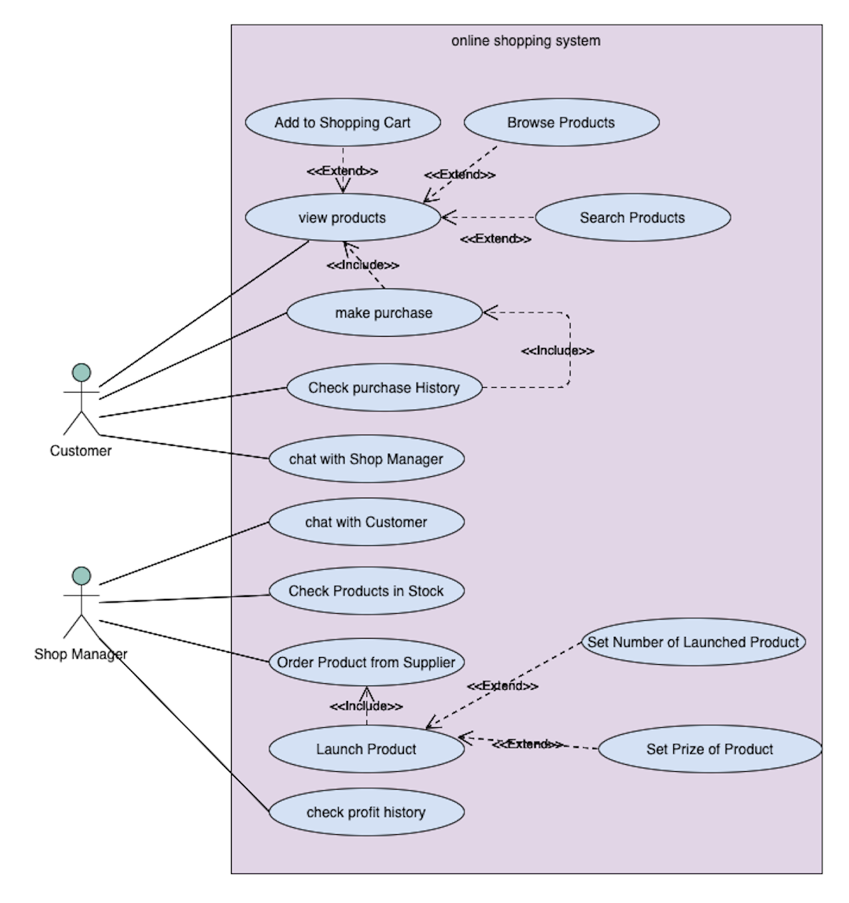
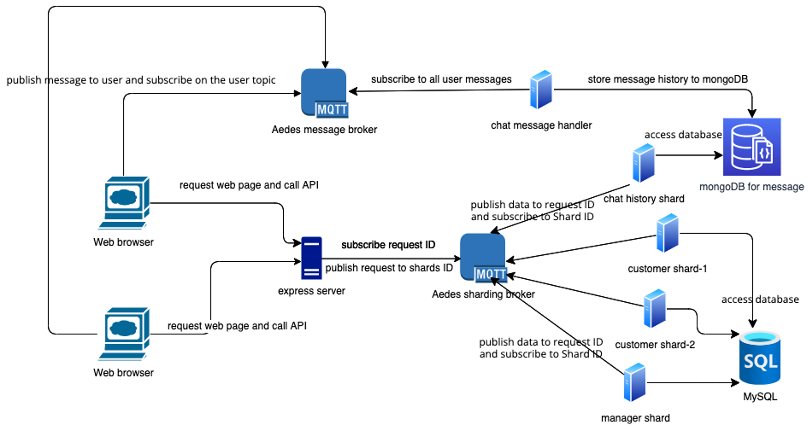
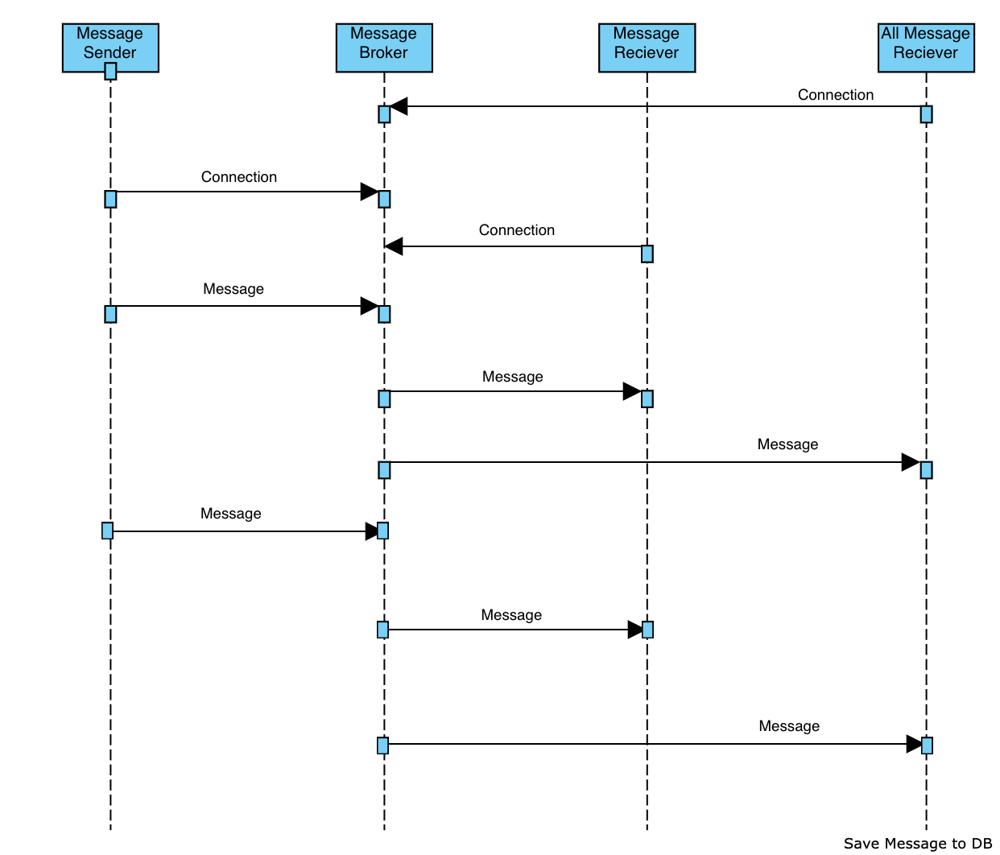

# Online_Shopping_System
## 系統說明
- 線上購物系統
- 買家可以註冊帳號並在網站上選購商品
- 賣家可從生產商進貨，並上架賣給消費者，並有後台管理系統可以管理自己的商城

## 系統功能需求
- 買家
  1. 可以在賣場搜尋商品種類，商家名稱，並把商品加入購物車
  2.	可從購物車刪除已選擇的商品
  3.	在購物車裡可以選擇商品數量並購買
  4.	購買後的商品可在歷史紀錄裡查看
  5. 可以與賣家溝通
<br/><br/>
- 賣家
  1.	可訂商品到指定倉庫
  2.	可從倉庫選擇商品上架販賣
  3.	可確認倉庫和架上貨品狀態
  4.	可查看出售紀錄
  5.	可以查看時間內營業額
  6.  可以與買家溝通
<br/><br/>

## Use Case Diagram


## Architecture Diagram


## Package Diagram


## Sequence Diagram



## 系統操作

- 主頁 (Home)


- 買家登入 


- 選購商品


- 購物車


- 購買紀錄

<br/><br/><br/>

- 賣家登入


- 倉儲管理


- 訂貨紀錄


- 交易紀錄


- 向生產商進貨


- 查看營業額


<br/><br/><br/>

<br/><br/><br/>

# 安裝執行

## Install and Import MySQL

1. Download MySQL at [here](https://dev.mysql.com/downloads/mysql/).
    * We set username as "root".

2. Go to MySQL shell:
    ```
    mysql -u root -p
    ```

3. Create a data base which is called "relation".
    ```
    create database relation;
    ```

4. Leave MySQL shell.
    ```
    quit;
    ```

5. Move .sql file from terminal to MySQL. (dbexport.sql is the DataBase you want to inport)
    ```
    mysql -u root -p relation < {dbexport.sql}
    ```

## Test mysql

1. Go to MySQL shell again.
    ```
    mysql -u root -p
    ```

2. Go to relation DataBase.
    ```
    use relation;
    ```

3. Check Customer in DataBase.
    ```
    select * from Customer;
    ```

    If there is something in your screen, then mysql is successfully installed.


- go to backend/config.js to set your MySQL setting
  ```javascript
  database_config:{
      host: 'localhost',
      user: 'root',
      password:  'yourPassword',
      database: 'relation'
    }
  ```

##  create database of mongoDB 
<br/>

* first, insall mongodb
  ```console
   brew install mongodb
  ```
* second, create db named dis_sys in mongodb
  ```console
  > use dis_sys
    switched to db dis_sys
  ```
* running the script below
  ```console
  node ./backend/chat_service/test/insert_data_for_test.js
  ```
  and you should have a collection in "dis_sys" whose name is "chat"

## install PM2 globally
  <br/>

* run as root
  ```
  npm i -g pm2
  ```
  or if user is sudo-er
  ```
  sudo npm i -g pm2
  ```

## prepare to run process
- go to backend and frontend directory and run
  ```
  npm install
  ```
  after installing the modules, run command below in backend
  ```
  pm2 start process.json
  ```
  if there is an error in web, run 
  ```
  npm run serve
  ```
  in frontend instead

- now you can use the website
  


